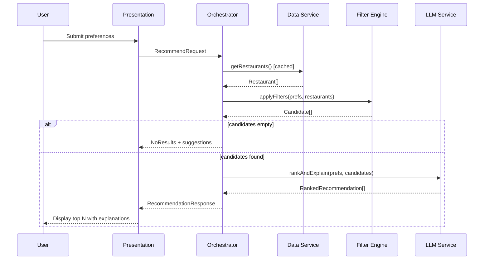

# System Architecture: AI-Powered Restaurant Recommendation System

> **Source:** Derived from [`docs/context.md`](./context.md) and the Zomato use-case problem statement.

---

## 1. Executive Summary

This document describes the technical architecture for an AI-powered restaurant recommendation service inspired by Zomato. The system combines **structured filtering** over a real Hugging Face dataset with **LLM-based ranking and explanation** so users receive grounded, personalized recommendations—not hallucinated listings.

**Core design principle:** *Retrieve and filter first, reason second.* The LLM operates only on candidate restaurants that already exist in the dataset.

---

## 2. Architectural Goals

| Goal | Description |
|------|-------------|
| **Grounded recommendations** | Every suggested restaurant must map to a dataset record |
| **Personalization** | Explanations reference the user’s stated preferences |
| **Separation of concerns** | Data, filtering, LLM, and presentation are independent modules |
| **Testability** | Filtering and prompt assembly are unit-testable without live LLM calls |
| **Extensibility** | New preference types, models, or UIs can be added without rewriting core logic |

---

## 3. High-Level Architecture

### 3.1 Layered View

```
┌──────────────────────────────────────────────────────────────────────────┐
│                         PRESENTATION LAYER                              │
│  Web UI / CLI  →  forms for prefs  →  renders ranked results + copy      │
└───────────────────────────────────┬──────────────────────────────────────┘
                                    │ HTTP / function calls
┌───────────────────────────────────▼──────────────────────────────────────┐
│                         APPLICATION LAYER                                 │
│  RecommendationOrchestrator  →  coordinates end-to-end request flow       │
└───────────────────────────────────┬──────────────────────────────────────┘
                                    │
        ┌───────────────────────────┼───────────────────────────┐
        ▼                           ▼                           ▼
┌───────────────┐         ┌─────────────────┐         ┌─────────────────┐
│  DATA LAYER   │         │  FILTER LAYER   │         │   LLM LAYER     │
│  Ingestion    │         │  Preference     │         │  Prompt build   │
│  Preprocess   │         │  matching       │         │  Rank + explain │
│  Cache/Store  │         │  Candidate set  │         │  Parse response │
└───────────────┘         └─────────────────┘         └─────────────────┘
        │                           │                           │
        └───────────────────────────┴───────────────────────────┘
                                    ▼
                          ┌─────────────────┐
                          │  EXTERNAL APIs  │
                          │  Hugging Face   │
                          │  Groq API       │
                          └─────────────────┘
```

### 3.2 Request Lifecycle



---

## 4. Component Architecture

### 4.1 Component Map

| Component | Responsibility | Depends On |
|-----------|----------------|------------|
| **DatasetLoader** | Fetch Zomato data from Hugging Face | `datasets` / HTTP |
| **Preprocessor** | Normalize fields, handle nulls, map budget tiers | Raw records |
| **RestaurantRepository** | In-memory or persisted store of structured restaurants | Preprocessor |
| **PreferenceCollector** | Validate and parse user input | UI / API schema |
| **FilterEngine** | Hard filters: location, cuisine, min rating, budget | Repository, UserPreferences |
| **CandidateSelector** | Cap list size, optional soft scoring before LLM | FilterEngine |
| **PromptBuilder** | Assemble system + user prompts with JSON context | UserPreferences, candidates |
| **LLMClient** | Call provider API, handle retries/timeouts | PromptBuilder |
| **ResponseParser** | Parse structured LLM output into typed recommendations | LLMClient |
| **RecommendationOrchestrator** | Wire pipeline, handle errors, return DTOs | All above |
| **PresentationAdapter** | Format for web/CLI display | Orchestrator output |

### 4.2 Recommended Module Structure

```
zomato-recommender/
├── app/
│   ├── main.py                 # Entry point (FastAPI / Streamlit / CLI)
│   ├── orchestrator.py         # RecommendationOrchestrator
│   └── config.py               # Env-based settings
├── data/
│   ├── loader.py               # DatasetLoader (Hugging Face)
│   ├── preprocessor.py         # Field normalization
│   ├── models.py               # Restaurant, UserPreferences dataclasses
│   └── repository.py           # RestaurantRepository
├── filtering/
│   ├── engine.py               # FilterEngine
│   └── budget.py               # low / medium / high mapping rules
├── llm/
│   ├── client.py               # LLMClient abstraction
│   ├── prompts.py              # PromptBuilder templates
│   └── parser.py               # ResponseParser
├── presentation/
│   ├── schemas.py              # API request/response models
│   └── formatter.py            # Human-readable output
└── tests/
    ├── test_filter_engine.py
    ├── test_preprocessor.py
    └── test_prompt_builder.py
```

---

## 5. Data Architecture

### 5.1 External Data Source

| Attribute | Value |
|-----------|-------|
| **Provider** | Hugging Face Datasets |
| **Dataset** | `ManikaSaini/zomato-restaurant-recommendation` |
| **URL** | https://huggingface.co/datasets/ManikaSaini/zomato-restaurant-recommendation |
| **Load strategy** | Download on first run; cache locally (Parquet/JSON) for subsequent starts |

### 5.2 Canonical Domain Model

```python
# Conceptual schema (language-agnostic)

Restaurant:
  id: string                    # stable identifier from dataset or generated hash
  name: string
  location: string              # city / area (normalized)
  cuisines: list[string]        # split multi-value cuisine field
  rating: float                 # e.g. 0.0–5.0
  cost_for_two: int | null      # raw numeric if available
  budget_tier: enum             # low | medium | high (derived)
  raw: dict                     # optional: preserve original row for debugging

UserPreferences:
  location: string
  budget: enum                   # low | medium | high
  cuisine: string | list[string]
  min_rating: float
  extras: list[string]          # e.g. "family-friendly", "quick service"
  top_n: int                     # default 5

RankedRecommendation:
  restaurant: Restaurant
  rank: int
  explanation: string            # LLM-generated, preference-aware
  match_highlights: list[string] # optional structured bullets

RecommendationResponse:
  recommendations: list[RankedRecommendation]
  summary: string | null          # optional LLM overview of choices
  metadata:
    total_candidates: int
    filters_applied: dict
```

### 5.3 Preprocessing Pipeline

```
Raw HF row
    → extract(name, location, cuisine, cost, rating, ...)
    → normalize strings (trim, title-case city)
    → parse cuisines (comma-separated → list)
    → coerce rating to float; drop invalid rows
    → derive budget_tier from cost_for_two using configurable thresholds
    → assign id (dataset key or hash(name + location))
    → Restaurant entity
```

### 5.4 Budget Tier Derivation

Budget is categorical in the product; map numeric cost to tiers at preprocess or filter time:

| Tier | Example rule (configurable) |
|------|-----------------------------|
| **low** | cost_for_two &lt; 500 |
| **medium** | 500 ≤ cost_for_two &lt; 1500 |
| **high** | cost_for_two ≥ 1500 |

Exact thresholds should be tuned after inspecting the dataset distribution.

---

## 6. Filtering Architecture

### 6.1 Filter Pipeline (Deterministic)

Filters run **before** the LLM to guarantee grounding:

```
ALL restaurants
  → location match (case-insensitive, substring or exact city)
  → cuisine match (any overlap with user cuisine)
  → min_rating ≥ user.min_rating
  → budget_tier == user.budget
  → [optional] extras: keyword scan on name/description if field exists
  → CandidateSelector: take top K by rating (e.g. K=20) to limit token usage
```

### 6.2 Filter Engine Contract

```
Input:  UserPreferences, List<Restaurant>
Output: List<Restaurant> (candidates), FilterStats

FilterStats:
  input_count: int
  output_count: int
  relaxed_filters: list[string]   # if fallback logic applied
```

### 6.3 Empty-Result Strategy

When zero candidates match strict filters, the orchestrator should **not** call the LLM with an empty list. Instead:

1. Return a clear “no matches” message to the user.
2. Optionally relax one filter at a time (e.g. widen budget tier) and suggest retry.
3. Never invent restaurants.

---

## 7. LLM Integration Architecture

### 7.1 Role of the LLM

The LLM is a **re-ranker and explainer**, not a data source:

| LLM does | LLM does not |
|----------|----------------|
| Rank provided candidates | Invent restaurant names |
| Write personalized explanations | Change factual fields (rating, cost) |
| Optionally summarize the set | Query external APIs |

### 7.2 Prompt Architecture

**Two-message pattern:**

1. **System prompt** — role, constraints, output format (JSON), grounding rules.
2. **User prompt** — serialized `UserPreferences` + compact JSON array of candidates (id, name, cuisine, rating, cost, budget_tier only).

**Grounding rules (include in system prompt):**

- Only recommend restaurants from the provided `candidates` list.
- Reference candidates by `id`; do not add new ids.
- Do not alter numeric rating or cost values.
- Tie each explanation to at least one user preference.

### 7.3 Example Structured Output Schema

```json
{
  "summary": "Three strong Italian options in Delhi within your budget.",
  "recommendations": [
    {
      "restaurant_id": "abc123",
      "rank": 1,
      "explanation": "Matches your Italian preference and 4.2+ rating requirement...",
      "match_highlights": ["Italian", "high rating", "medium budget"]
    }
  ]
}
```

### 7.4 LLM Client Abstraction

```
interface LLMClient:
  complete(prompt: PromptPayload) -> LLMRawResponse

Implementations:
  - GroqClient (MVP / Phase 3 default)
  - MockLLMClient (tests)
  - (optional later) OpenAIClient, OllamaClient, etc.
```

**MVP provider: [Groq](https://console.groq.com/)**

Phase 3 uses the Groq Chat Completions API via the official `groq` Python SDK. Groq hosts fast inference for open models (e.g. Llama, Mixtral), which fits the ranking + JSON explanation workload without OpenAI.

**Configuration (environment):**

- `LLM_PROVIDER` — default `groq`
- `LLM_MODEL` — default e.g. `llama-3.3-70b-versatile` (override per Groq model catalog)
- `LLM_API_KEY` — Groq API key from [console.groq.com](https://console.groq.com/) (never commit)
- `LLM_MAX_TOKENS`, `LLM_TEMPERATURE` (low temperature preferred for ranking consistency)
- `CANDIDATE_LIMIT` (max restaurants sent to LLM, e.g. 15–25)

### 7.5 Response Parsing & Validation

```
LLMRawResponse
  → JSON parse
  → validate each restaurant_id exists in candidate set
  → merge LLM fields with Restaurant entities
  → if parse fails: fallback to rating-sorted top N with generic explanations
```

---

## 8. Application / Orchestration Layer

### 8.1 RecommendationOrchestrator

Single entry point for the recommendation use case:

```
recommend(preferences: UserPreferences) -> RecommendationResponse:

  1. restaurants = repository.get_all()
  2. candidates, stats = filter_engine.apply(preferences, restaurants)
  3. if candidates is empty:
       return empty_response(stats)
  4. prompt = prompt_builder.build(preferences, candidates)
  5. raw = llm_client.complete(prompt)
  6. ranked = response_parser.parse(raw, candidates)
  7. return RecommendationResponse(recommendations=ranked[:preferences.top_n], ...)
```

### 8.2 Error Handling

| Failure | Behavior |
|---------|----------|
| Dataset load fails | Fail fast with actionable message; no recommendations |
| LLM timeout / API error | Return filter-only top N sorted by rating + note that AI explanations unavailable |
| Invalid user input | 400 with field-level validation errors |
| Malformed LLM JSON | Retry once; then fallback ranking |

---

## 9. Presentation Architecture

### 9.1 UI Options

| Option | Pros | Best for |
|--------|------|----------|
| **Streamlit** | Fast to build, Python-native | Hackathons, demos |
| **FastAPI + React** | Production-style API + SPA | Portfolio / scale |
| **CLI** | Simple testing | Development |

### 9.2 User Input Form

Collect and validate:

- Location (dropdown or autocomplete from distinct cities in dataset)
- Budget (`low` | `medium` | `high`)
- Cuisine (dropdown from distinct cuisines)
- Minimum rating (slider 0–5)
- Additional preferences (free text or tags)
- Number of results (optional, default 5)

### 9.3 Result Card Layout

Each recommendation card displays:

| Field | Source |
|-------|--------|
| Restaurant name | Dataset |
| Cuisine | Dataset |
| Rating | Dataset |
| Estimated cost | Dataset (`cost_for_two` or tier label) |
| AI explanation | LLM |
| Rank badge | LLM |

Optional: collapsible “Why these picks?” section showing LLM `summary`.

---

## 10. API Design (if using FastAPI)

### 10.1 Endpoints

| Method | Path | Description |
|--------|------|-------------|
| `GET` | `/health` | Liveness check |
| `GET` | `/meta/locations` | Distinct cities for UI dropdown |
| `GET` | `/meta/cuisines` | Distinct cuisines for UI dropdown |
| `POST` | `/recommendations` | Body: `UserPreferences` → `RecommendationResponse` |

### 10.2 Example Request / Response

**POST `/recommendations`**

```json
{
  "location": "Delhi",
  "budget": "medium",
  "cuisine": "Italian",
  "min_rating": 4.0,
  "extras": ["family-friendly"],
  "top_n": 5
}
```

```json
{
  "recommendations": [
    {
      "rank": 1,
      "restaurant": {
        "id": "abc123",
        "name": "Example Bistro",
        "location": "Delhi",
        "cuisines": ["Italian"],
        "rating": 4.5,
        "cost_for_two": 800,
        "budget_tier": "medium"
      },
      "explanation": "Highly rated Italian spot in Delhi within your medium budget..."
    }
  ],
  "summary": "All picks are Italian restaurants in Delhi with ratings ≥ 4.0.",
  "metadata": {
    "total_candidates": 12,
    "filters_applied": { "location": "Delhi", "budget": "medium" }
  }
}
```

---

## 11. Cross-Cutting Concerns

### 11.1 Configuration Management

Centralize in `config.py` / environment variables:

- Dataset name and cache path
- Budget tier thresholds
- `CANDIDATE_LIMIT`, `DEFAULT_TOP_N`
- LLM provider settings

### 11.2 Caching Strategy

| Cache | Key | TTL |
|-------|-----|-----|
| Processed restaurants | Dataset version / file mtime | Until dataset changes |
| HF download | Local path | Persistent on disk |
| LLM responses | Hash(preferences + candidate ids) | Optional; short TTL for demos |

### 11.3 Observability

- Log: filter stats, candidate count, LLM latency, parse success/failure
- Metrics (optional): request count, empty-result rate, LLM error rate

### 11.4 Security & Privacy

- Store `LLM_API_KEY` in environment only; never commit secrets
- No PII required for MVP; preferences are session-scoped
- Rate-limit `/recommendations` if exposed publicly

---

## 12. Technology Stack (Recommended)

| Layer | Suggested technology |
|-------|----------------------|
| Language | Python 3.10+ |
| Dataset | `datasets` (Hugging Face) |
| Data models | `pydantic` or `dataclasses` |
| API (optional) | FastAPI + Uvicorn |
| UI (optional) | Streamlit or React |
| LLM | **Groq** (MVP); pluggable `LLMClient` for other providers later |
| LLM SDK | `groq` |
| Testing | `pytest` + `MockLLMClient` |
| Packaging | `requirements.txt` or `pyproject.toml` |

---

## 13. Deployment Topology

### 13.1 Local / Demo

```
[Developer machine]
  Streamlit/FastAPI + in-memory repository + cached dataset
  → Groq API (internet)
```

### 13.2 Containerized (optional)

```
[Docker container: app]
  → mounted volume: /data/cache (preprocessed restaurants)
  → env: LLM_API_KEY (Groq key), LLM_PROVIDER=groq
  → Hugging Face fetch on build or first run
```

---

## 14. Testing Strategy

| Layer | Test focus |
|-------|------------|
| **Preprocessor** | Null handling, cuisine split, budget tier mapping |
| **FilterEngine** | Each filter in isolation; combined filters; empty results |
| **PromptBuilder** | Snapshot tests for prompt text; candidate ids included |
| **ResponseParser** | Valid JSON; reject unknown ids; fallback path |
| **Orchestrator** | Integration with `MockLLMClient`; no live API in CI |
| **E2E (optional)** | One golden path with recorded LLM response |

---

## 15. Implementation Phases

| Phase | Deliverable |
|-------|-------------|
| **1 — Data** | Load HF dataset, preprocess, in-memory repository |
| **2 — Filter** | FilterEngine + empty-result handling |
| **3 — LLM** | PromptBuilder, LLMClient, ResponseParser |
| **4 — Orchestration** | RecommendationOrchestrator end-to-end |
| **5 — UI** | Preference form + recommendation cards |
| **6 — Hardening** | Tests, config, error fallbacks, README |

---

## 16. Architecture Decision Records (ADR)

### ADR-001: Filter before LLM

**Decision:** Apply deterministic filters on the full dataset before sending candidates to the LLM.

**Rationale:** Prevents hallucinated restaurants; reduces tokens; improves latency.

### ADR-002: Structured LLM output (JSON)

**Decision:** Require JSON output with `restaurant_id` references.

**Rationale:** Enables validation and reliable merging with dataset records.

### ADR-003: Cap candidates sent to LLM

**Decision:** Limit to top K by rating (e.g. 20) after filtering.

**Rationale:** Controls cost and context window size while keeping quality pool.

### ADR-004: Pluggable LLM client (Groq for MVP)

**Decision:** Abstract provider behind `LLMClient` interface; ship **Groq** as the first real implementation in Phase 3.

**Rationale:** Groq offers low-latency inference and a simple Chat Completions API suitable for JSON ranking tasks; the abstraction still allows swapping providers later without changing the orchestrator.

---

## 17. Related Documents

| Document | Purpose |
|----------|---------|
| [`docs/context.md`](./context.md) | Product context, workflow, requirements |
| [`docs/problemStatement.txt`](./problemStatement.txt) | Original problem statement |

---

## 18. Glossary

| Term | Definition |
|------|------------|
| **Candidate** | Restaurant that passed all filters; input to LLM |
| **Grounding** | Ensuring outputs refer only to real dataset records |
| **Budget tier** | Categorical cost bucket: low / medium / high |
| **Orchestrator** | Component that runs the full recommend pipeline |
